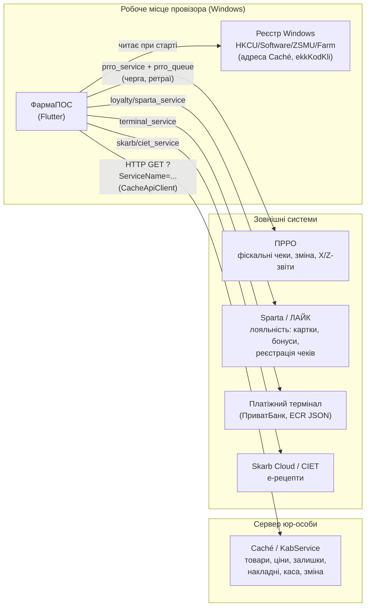
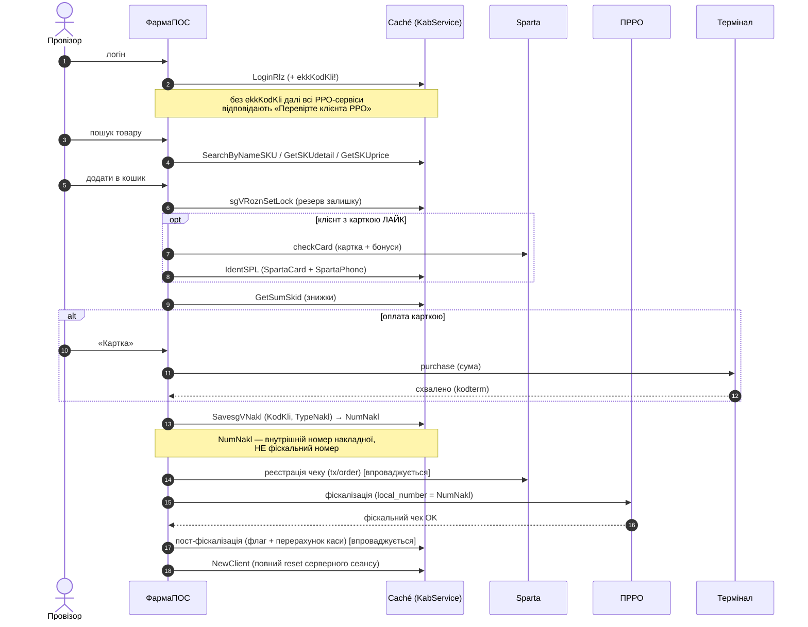
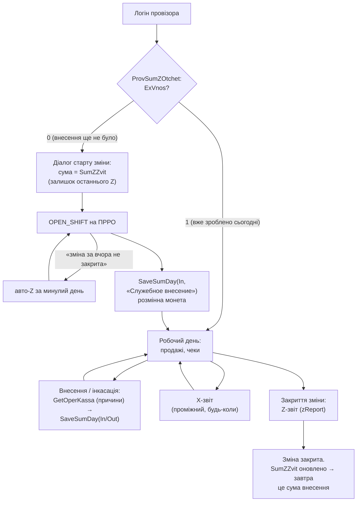

# ФармаПОС — онбординг нової команди

> **Прочитайте цей документ першим.** Він дає картину всього проекту за ~30 хвилин.
> Деталі — за посиланнями в кінці.

---

## 1. Що це за проект

**ФармаПОС** — POS-застосунок робочого місця провізора в аптеці мережі:
пошук і продаж ліків, кошик, оплата (готівка/картка), фіскалізація чека (ПРРО),
лояльність (Sparta/ЛАЙК), акції, інтернет-замовлення, е-рецепти, касова зміна.

- **Технологія:** Flutter (Dart), десктоп **Windows**. Є збірка web, але вона
  впирається в CORS проти бекенду — робоча платформа лише Windows.
- **Замінює** legacy Delphi «Роздрібний модуль» — тому частина серверних назв
  і причин операцій російською (legacy бекенду).
- **Критичність:** це каса. Якщо застосунок не працює — аптека не продає.
  Пріоритет підтримки: продаж і фіскалізація мають працювати завжди.

## 2. Швидкий старт (запуск за 10 хвилин)

```powershell
# dev-запуск (потрібна мережа аптеки — бекенд живий)
flutter run -d windows --no-pub --dart-define-from-file=dart_define.json

# release-збірка → build\windows\x64\runner\Release\pharmacy_app.exe
flutter build windows --release --dart-define-from-file=dart_define.json

# тести та аналіз
flutter test
flutter analyze
```

Важливо знати:

- **`dart_define.json`** (gitignored, шаблон — `dart_define.example.json`) містить
  креденшели зовнішніх API (ПРРО, лояльність, Skarb, Apiator). **Без прапорця
  `--dart-define-from-file` ці сервіси отримають порожні креденшели й мовчки
  відваляться.** Завжди передавайте його.
- **Per-аптечний конфіг** читається з реєстру Windows `HKCU\Software\ZSMU\Farm`
  (`RegistryConfig`): адреса Caché-бекенду (`MAddr`/`MPortS`/`MNSpace`) та код
  каси `ekkKodKli`. На машині розробника ці ключі треба створити (див.
  [vm_setup.md](vm_setup.md)).
- Перша збірка ~4–5 хв, далі кешовано ~1–2 хв. Dart-код живе в `data\app.so`
  поруч з exe — за його timestamp видно, чи перезібрався реліз.

**Виглядає успішно:** відкрилось вікно логіну зі списком фармацевтів
(`GetUsersRlz`), після входу — головний екран з пошуком товарів.

## 3. Архітектура: з чим застосунок розмовляє



Ключові факти про інтеграції:

- **Caché (KabService)** — головний бекенд. Усі виклики — HTTP GET з параметром
  `ServiceName` (наприклад `?ServiceName=SearchByNameSKU&...`). Відповіді — JSON,
  суми часто рядками з комою (`"14187,46"`). За бекенд відповідає **Катерина
  Карпенко**.
- **ПРРО** — фіскалізація. Виклики йдуть через **чергу** (`prro_queue`) з
  ретраями, бо чек зобовʼязаний дійти. Обережно з ретраями «грошових» сервісів
  при неоднозначних збоях — повторний виклик може задвоїти операцію.
- **Sparta** — лояльність (картка + бонуси) і реєстрація чеків. Sparta і ПРРО
  взаємозалежні у флоу продажу. Контакт — **Андрій Попов**.
- **Термінал** — безготівкова оплата за протоколом ПриватБанк ECR (JSON);
  `GetTermBank` повертає список терміналів аптеки (основний + резервний).
- **Гроші** — всюди тип `Money` (копійки, int). **Ніколи не рахуйте гроші в
  `double`** — це джерело копійчаних розбіжностей з фіскальним чеком.

## 4. Головний флоу: продаж (це 80% підтримки)

Майже всі інциденти — збій на якомусь кроці цього ланцюжка. Діаграма показує,
*де* шукати.



Правила, які треба знати:

- **`NewClient` викликається ПІСЛЯ обслуговування** (або при відмові клієнта) —
  це скидання серверного сеансу, не «початок роботи з клієнтом».
- **Порядок жорсткий:** спершу `SavesgVNakl` (накладна в базі аптеки), потім
  фіскалізація. `local_number` чека ПРРО = `NumNakl` — за ним звіряють накладну
  з фіскальним чеком.
- `KodKli` у накладній залежить від оплати: готівка → код каси (`ekkKodKli`),
  картка → `kodterm` терміналу. `TypeNakl`: готівка = 2, картка = 5.
- Резерв залишку (`sgVRoznSetLock`) знімається при видаленні з кошика, очищенні
  кошика чи закритті застосунку — «зависла» позиція в резерві блокує продаж на
  інших касах.

## 5. Життєвий цикл касової зміни



- Службове внесення — **раз на день** (`ExVnos` не скидається Z-звітом того ж дня).
- «Завислу» вчорашню зміну флоу закриває сам: авто-Z і повторний OPEN_SHIFT.
- Причини касових операцій приходять з бекенду російською — legacy Delphi;
  в UI мапляться на українські.
- Тимчасові кнопки «Відкрити/Закрити зміну» на дашборді — операційний фолбек,
  заплановані до видалення після стабілізації авто-флоу.

## 6. Глосарій домену

| Термін | Що означає |
|---|---|
| **Накладна** | Запис продажу в базі аптеки (Caché). `NumNakl` — її внутрішній номер (bigint). Це **не** фіскальний чек. |
| **Фіскальний чек** | Чек, зареєстрований у податковій через ПРРО. Має власний фіскальний номер. |
| **ПРРО** | Програмний реєстратор розрахункових операцій — «віртуальна каса» замість фіскального апарата. |
| **Серверний сеанс** | Стан обслуговування одного клієнта на Caché (кошик, ідентифікація). Скидається через `NewClient`. |
| **ekkKodKli** | Код каси/клієнта РРО з реєстру Windows. Обовʼязковий у `LoginRlz`; без нього всі РРО-сервіси відмовляють. |
| **Z-звіт** | Фінальний денний звіт, закриває зміну на РРО. **X-звіт** — проміжний, зміну не закриває. |
| **Службове внесення** | Внесення розмінної монети на початку дня; фактичний «старт зміни» в бізнес-сенсі. |
| **Інкасація** | Винесення готівки з каси (`SaveSumDay(Out)`). |
| **Sparta / ЛАЙК** | Система лояльності: картки, бонуси, реєстрація чеків. |
| **ЄДК** («Є Дещо Краще») | Пропозиція вигіднішої заміни товару з бонусом фармацевту. |
| **СТМ** | Власна торгова марка мережі. |
| **Акція / стоп-ціна** | Промо-правила (% або грн). «Набір» — умовна знижка (за комплект). Акційна ціна в UI — зелена, деталі — попап (ⓘ). |
| **Дефектура** | Тимчасова відсутність товару в аптеці. |
| **ІЗ** | Інтернет-замовлення (клієнт замовив онлайн, забирає в аптеці). |
| **kodterm** | Код платіжного терміналу; йде в накладну як `KodKli` при оплаті карткою. |

## 7. Карта коду

```
lib/
├── main.dart                 — вхід, логін, роутінг
├── screens/pos_screen.dart   — головний екран (God-screen: пошук + кошик + панелі)
├── services/                 — по сервісу на інтеграцію:
│   ├── cache_api_client.dart     — HTTP-клієнт Caché (?ServiceName=...)
│   ├── auth_service.dart         — LoginRlz, фармацевти
│   ├── session_service.dart      — NewClient / IdentSPL / SavesgVNakl
│   ├── prro_service.dart         — фіскалізація, зміна, X/Z-звіти
│   ├── prro_queue.dart           — черга ПРРО-запитів з ретраями
│   ├── shift_service.dart        — старт/закриття зміни (композиція ПРРО+Caché)
│   ├── cash_service.dart         — GetOperKassa / SaveSumDay (каса)
│   ├── terminal_service.dart     — платіжний термінал, GetTermBank
│   ├── loyalty_service.dart      — Sparta: картка, бонуси
│   ├── sparta_service.dart       — Sparta: реєстрація чеків (tx/*)
│   ├── registry_config.dart      — конфіг з реєстру Windows
│   ├── stop_price_service.dart   — акції/стоп-ціни
│   └── ...                       — drug/order/skarb/ciet/farmasell/...
├── models/                   — доменні моделі; ключова: money.dart (копійки!)
├── widgets/
│   ├── cart_panel.dart           — кошик і checkout (ядро флоу продажу)
│   ├── shift_start_dialog.dart / shift_end_dialog.dart — зміна
│   └── ...                       — панелі, діалоги
├── mixins/checkout_mixin.dart — логіка оформлення
├── data/mock_*.dart           — мок-дані (частина ще підключена в білд — обережно)
└── utils/
```

Точки входу для розуміння коду: `pos_screen.dart` (композиція UI) →
`cart_panel.dart` (checkout) → `session_service.dart` + `prro_service.dart`
(серверний флоу продажу).

## 8. Люди та зони відповідальності

| Хто | За що | Коли звертатись |
|---|---|---|
| **Катерина Карпенко** | Бекенд Caché/KabService (накладні, каса, зміна, довідники, термінали) | Питання по будь-якому `ServiceName=...`, нові сервіси, формати відповідей |
| **Андрій Попов** | Sparta: реєстрація чеків, лояльність | Флоу `tx/order → tx/orderModify → tx/orderStatusChange`, офлайн-режим |

Тон робочого листування — формальне «ви».

## 9. Куди далі

| Документ | Що всередині |
|---|---|
| [pharmacy_processes.md](pharmacy_processes.md) | Інвентаризація всіх бізнес-процесів: що реалізовано, що ні, пріоритети |
| [action_plan.md](action_plan.md) | Поточний план робіт |
| [backend_tasks.md](backend_tasks.md) | Задачі та відповіді бекенду (історія узгоджень з Катею) |
| [reengineering_plan.md](reengineering_plan.md) | План реінжинірингу legacy-функціональності |
| [vm_setup.md](vm_setup.md) | Налаштування машини/VM для розробки |
| `Інструкція_ Початок зміни...docx` | Як зміна працює в legacy Delphi-модулі (еталон процесу) |
| `Технічний опис ... безготівкового розрахунку Europharma.docx` | Безготівковий флоу |
| `ECR_протокол_ПриватБанк...pdf` | Протокол платіжного терміналу |
| API_TX_NGD_ANC_23.html | Довідник API |

> Порада новачку: перший тиждень — запустіть застосунок на тестовому контурі,
> проведіть один продаж від логіну до фіскального чека, дивлячись у логи
> запитів. Один живий прогін пояснює більше, ніж усі документи разом.
